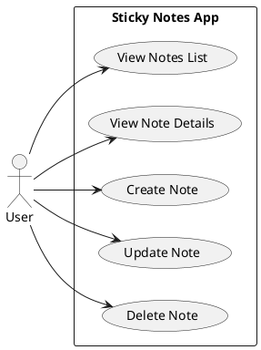
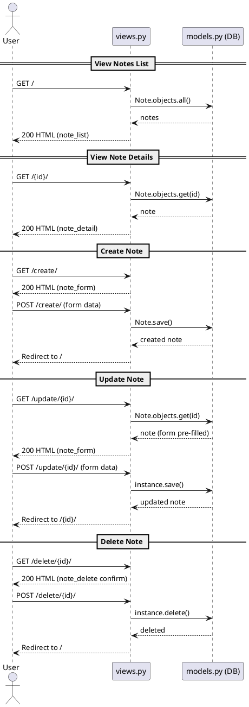

# Django---Sticky-Notes
Application Part 1 & 2

## Setup Instructions

python -m venv venv
source venv/bin/activate #Windows: venv\Scripts\activate
pip install -r requirements
python manage.py migrate
python manage.py createsuperuser
python manage.py runserver

## Diagrams (Use Case + Sequence)

Render these PlantUML sources (https://plantuml.com/ or VSCode PlantUML) — they map exactly to the app routes and views.

Use Case Diagram:

Sequence Diagram (combined flows):

